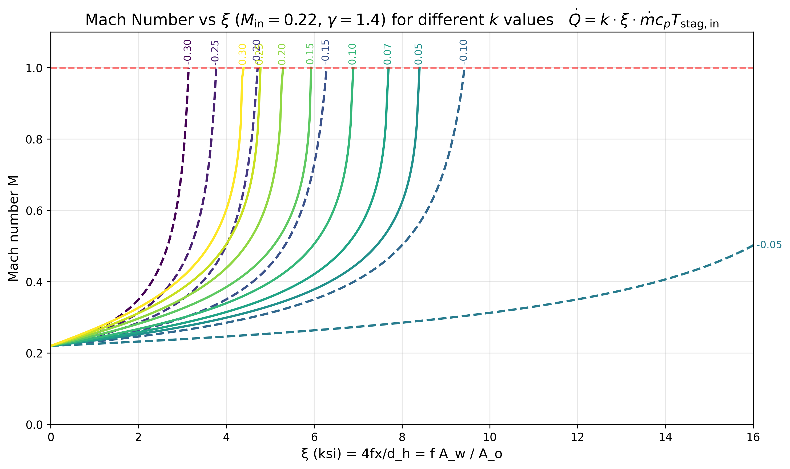
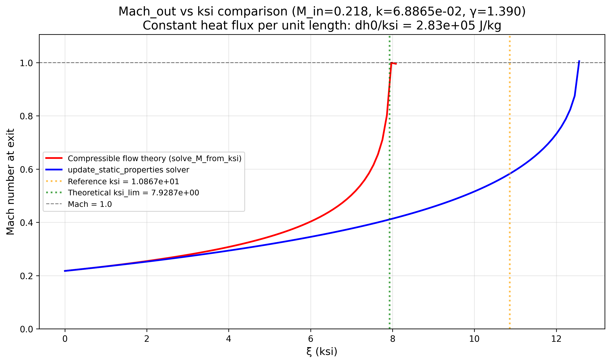

# Choking Flow with Friction and Heat Transfer

This document describes the theory and implementation of compressible flow with simultaneous friction and heat transfer, particularly focusing on the choking limit ($\xi_\text{lim}$) where the flow reaches Mach 1.0.

## Introduction

In heat exchanger applications, compressible flow effects become important when the Mach number approaches unity. The combination of friction and heat addition can cause the flow to accelerate and potentially choke. The analysis is based on the work of Sturas (1971) for constant-area flow with friction and heat transfer.

## Key Parameters

### $\xi$ (ksi) - Friction Parameter

The friction parameter $\xi$ (ksi) is defined as:

$$
\begin{equation}
\xi = \frac{4fx}{d_h} = \frac{f A_w}{A_o}
\end{equation}
$$

where:

- $f$ is the average equivalent friction factor: $f = \tau_0 / (0.5 \rho V^2)$
  - **Note**: $\tau_0$ (tau with subscript zero) is the **wall shear stress**, not to be confused with $\tau$ (tau without subscript) which is the stagnation temperature ratio defined below
- $x$ is the distance along the flow path
- $d_h$ is the hydraulic diameter
- $A_w$ is the wetted area
- $A_o$ is the cross-sectional flow area

The parameter $\xi$ represents the cumulative friction effect along the flow path. It increases monotonically as the flow progresses through the heat exchanger.

### $k$ - Heat Addition Parameter

The heat addition parameter $k$, which is assumed constant, is defined as:

$$
\begin{equation}
k = \frac{\Delta h_0}{h_{0,\text{in}} \cdot \xi} = \frac{\dot{Q}}{\dot{m} c_p T_{0,\text{in}} \cdot \xi}
\end{equation}
$$

where:

- $\Delta h_0$ is the stagnation enthalpy change per unit mass
- $h_{0,\text{in}}$ is the inlet stagnation enthalpy
- $\dot{Q}$ is the heat transfer rate
- $\dot{m}$ is the mass flow rate
- $c_p$ is the specific heat at constant pressure
- $T_{0,\text{in}}$ is the inlet stagnation temperature

The parameter $k$ represents the normalized heat addition rate per unit friction. For constant heat flux per unit length (or uniform $U \Delta T$), $k$ remains constant along the flow path.

### $\tau$ - Stagnation Temperature Ratio

**Important**: The symbol $\tau$ (tau without subscript) represents the **stagnation temperature ratio**, which is completely different from $\tau_0$ (tau with subscript zero) which represents **wall shear stress**. Always check the subscript to avoid confusion.

The stagnation temperature ratio $\tau$ is defined as:

$$
\begin{equation}
\tau = \frac{T_0}{T_{0,\text{in}}} = 1 + k \xi
\end{equation}
$$

where $T_0$ is the local stagnation temperature. This relationship shows that the stagnation temperature increases linearly with $\xi$ when $k$ is constant.

**Summary of notation:**

- $\tau$ (no subscript) = stagnation temperature ratio = $T_0/T_{0,\text{in}} = 1 + k\xi$
- $\tau_0$ (with subscript zero) = wall shear stress = friction force per unit area

## Fundamental Equations

The analysis is based on the following key equations from Sturas (1971):

### Equation 6: Mach Number from Flow Parameter

$$
\begin{equation}
M^2 = \frac{V^2}{\gamma \tau - \frac{\gamma - 1}{2} V^2}
\end{equation}
$$

where $V$ is a dimensionless flow parameter, $\gamma$ is the ratio of specific heats, and **$\tau$ is the stagnation temperature ratio** (not wall shear stress).

### Equation 7: Flow Parameter from Mach Number

$$
\begin{equation}
V^2 = \frac{\gamma M^2 \tau}{1 + \frac{\gamma - 1}{2} M^2}
\end{equation}
$$

where **$\tau$ is the stagnation temperature ratio** (not wall shear stress).

### Equation 13: Friction Parameter from Flow Parameters

$$
\begin{equation}
\xi = \frac{V}{V_0} \sqrt{\frac{V_0^2 + 2k}{V^2 + 2k}} \cdot \frac{1}{k} - \frac{1}{k} + \frac{V}{2} \frac{\gamma + 1}{\gamma} \frac{1}{\sqrt{V^2 + 2k}} \ln\left(\frac{V_0^2 + k + V_0 \sqrt{V_0^2 + 2k}}{V^2 + k + V \sqrt{V^2 + 2k}}\right)
\end{equation}
$$

where $V_0$ is the inlet dimensionless flow parameter.

### Equation 18: Pressure Ratio

$$
\begin{equation}
\frac{p}{p_0} = \frac{M_0}{M} \sqrt{\frac{1 + \frac{\gamma - 1}{2} M_0^2}{1 + \frac{\gamma - 1}{2} M^2} \cdot (1 + k \xi)}
\end{equation}
$$

where $p_0$ is the inlet static pressure.

## Choking Limit ($\xi_\text{lim}$)

The choking limit $\xi_\text{lim}$ is the value of $\xi$ at which the Mach number reaches its maximum value (typically just below 1.0 for subsonic flow, or exactly 1.0 at choking). Beyond this point, the flow cannot accelerate further without violating conservation laws.

### Finding $\xi_\text{lim}$

The function `find_ksi_lim_adaptive` uses an adaptive stepping algorithm to find $\xi_\text{lim}$:

1. Start from a small $\xi$ value
2. Solve for $M$ at each $\xi$ using `solve_M_from_ksi`
3. Track the maximum $M$ and corresponding $\xi$
4. Stop when:
   - $M \geq 1.0$ (choked)
   - $M$ starts decreasing (supersonic branch detected)
   - Solution fails

The algorithm adaptively reduces the step size as $M$ approaches 1.0 to accurately capture the choking point.

## Behavior for Different $k$ Values

The relationship between Mach number and $\xi$ depends strongly on the heat addition parameter $k$:

### Positive $k$ (Heating)

For positive $k$ (heat addition) and negative $k$ (cooling):

- The Mach number initially increases with $\xi$
- The flow chokes when $M$ reaches 1.0

The figure above shows how Mach number varies with $\xi$ for different $k$ values. Positive $k$ values (solid lines) and negative $k$ values (dashed lines in the figure) both show monotonic increase to choking.

## Comparison with Current Implementation

The current implementation in `update_static_properties` solves the conservation equations for finite steps:

$$
\begin{align}
\Delta h_0 &= h_{0,\text{out}} - h_{0,\text{in}} \\
\Delta(p + G^2/\rho) &= -\tau_0 \frac{dA}{A_c}
\end{align}
$$

where $G = \rho V$ is the mass flux. **Note**: In the momentum equation, $\tau_0$ is the **wall shear stress** (friction force per unit area), not the stagnation temperature ratio $\tau$. The term $\tau_0 dA/A_c$ represents the pressure drop due to wall friction.

### Key Difference

The main difference between the compressible flow theory and the current `update_static_properties` implementation is:

**Compressible Flow Theory (Sturas 1971):**

- Assumes constant area flow
- Accounts for the continuous change in $\tau = 1 + k\xi$ along the flow path
- The stagnation temperature ratio $\tau$ changes continuously as density decreases and Mach approaches 1
- Provides analytical relationships between $\xi$, $M$, and pressure ratios

**Current `update_static_properties` Implementation:**

- Solves conservation equations for finite steps
- Does not explicitly account for the change in $\tau_0$ (wall shear stress) within a segment
- As density decreases significantly (Mach → 1, pressure drops), the wall shear stress $\tau_0$ changes within the segment due to changing velocity and density, but this is not explicitly tracked
- The step-wise approach can lead to discrepancies near choking conditions where the flow properties change rapidly

**Potential Solution:** The issue with $\tau_0$ not being properly accounted for could be addressed by dividing each segment into multiple sub-segments and calling `update_static_properties` on each sub-segment with the correct density (and thus velocity) as input. This would allow $\tau_0$ to be updated based on the local flow conditions. However, this approach causes problems when performing a 0D analysis of the whole flow, as it requires marching through the flow path rather than solving the entire heat exchanger as a single 0D unit. The 0D approach relies on being able to treat each segment independently without needing to know intermediate flow states, which would be lost with sub-segmentation.

The figure above compares the theoretical solution (red line) with the `update_static_properties` solver (blue line). The solver generally follows the theory well but may diverge near choking conditions where the rapid changes in density and pressure require accounting for the continuous change in $\tau_0$ (wall shear stress) within each segment. As velocity increases and density decreases, the wall shear stress $\tau_0$ changes, but the step-wise approach treats it as constant within each segment.

### Implications

When the flow approaches choking:

1. Density decreases significantly as pressure drops
2. Velocity increases as the flow accelerates toward Mach 1
3. The wall shear stress $\tau_0$ changes continuously within the segment due to changing velocity and density, but the step-wise approach treats it as constant
4. The step-wise approach in `update_static_properties` may not fully capture this effect
5. This can lead to:
   - Convergence issues
   - Inaccurate predictions near choking
   - Underestimation of the maximum achievable $\xi$ before choking

## Practical Applications

Understanding $\xi_\text{lim}$ is crucial for:

- **Design limits**: Determining the maximum heat transfer and friction that can be applied before choking
- **Performance prediction**: Accurately predicting flow behavior near choking conditions
- **Optimization**: Balancing heat transfer, pressure drop, and flow capacity

## References

- Sturas, A. (1971). _Compressible Flow with Friction and Heat Transfer_. NASA Technical Report. [Link](https://ntrs.nasa.gov/api/citations/19720004565/downloads/19720004565.pdf)
